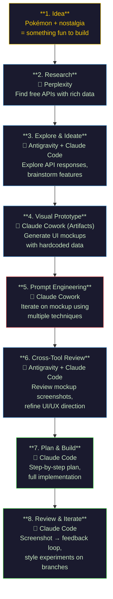

# Week 1: PokeArena Analytics

A React SPA that integrates real-time Pokémon data from the PokeAPI v2, provides matchup comparisons via stat radar charts, and runs a calculated turn-based battle simulation.

## Features

- **Single Search** — Search any Pokémon by name, view official artwork, type badges, base stat bars, and a filterable moves grid
- **Battle Arena** — Pick two Pokémon (via search, quick-pick pills, or random type-based draft), compare stats on an overlay radar chart, and run a full battle simulation
- **Battle Simulation** — Turn-based engine with type effectiveness (dual-type stacking for 4x/0.25x), STAB, physical/special split, accuracy checks, and damage variance
- **Animated Playback** — Health bars drain in real-time, combat log scrolls per turn, winner overlay with data-driven analytical insight
- **Theme Toggle** — Switch between a premium dark-mode "Vibrant" theme and a monochrome "Blueprint" wireframe mode
- **Pokédex Device UI** — Full retro device shell with CRT scan-lines, pulsing LEDs, beveled buttons, and screen glow effects

---

## How This Was Built — AI-Assisted Development Flow

This entire project was built in a single day with **zero lines of hand-written code**. Every line was generated through AI tools, guided by iterative prompting and cross-tool collaboration. Here's how.

### The Flow



### Step-by-Step Breakdown

#### 1. Starting Point — Pick something fun

I wanted to build something real with AI tools, not just a boilerplate CRUD app. As a software developer already familiar with AI tooling, I wanted to push further. Pokémon was one of my favorite childhood shows — so I started with: *"Can I build some kind of Pokémon simulator?"*

#### 2. Research — Finding the right data source

**Tool: Perplexity**

I didn't want to work with a static CSV. I prompted Perplexity to find free, publicly available APIs with Pokémon data — what endpoints exist, what kind of information they return, and whether they include images (not just text). It surfaced [PokeAPI](https://pokeapi.co/) as the best option: free, no auth, rich data including sprites, stats, moves, types, abilities, and evolution chains.

#### 3. Explore & Ideate — What can we actually build?

**Tools: Antigravity + Claude Code (in parallel)**

I passed the PokeAPI finding to both tools simultaneously and asked each to:
- Explore the API endpoints and inspect what data comes back
- Suggest project ideas that would be visually interesting

I cross-pollinated their outputs — taking ideas from one and feeding them to the other to refine further. This gave me a solid feature set: a Pokémon search/explorer, stat comparisons via radar charts, and a battle simulator.

#### 4. Visual Prototype — See it before building it

**Tool: Claude Cowork (Artifacts)**

I took the refined concept to Claude Cowork to generate a visual prototype. Initially it tried to make live API calls to PokeAPI, which failed in the Artifact sandbox. I adjusted the prompt: *"Don't call the API — just hardcode sample data so I can see what the UI would look like."* That worked perfectly for validating the visual direction.

#### 5. Prompt Engineering — Iterate on the mockup

**Tool: Claude Cowork (Artifacts)**

I ran several iterations on the visual prototype using different prompting techniques:

| Technique | How I used it |
|-----------|---------------|
| **One-shot prompting** | Gave a single detailed description of what I wanted |
| **Refinement prompting** | Took the output and asked for specific changes |
| **Example-based** | Showed it a reference of what the UI should look like, then asked it to build toward that |
| **ReAct (Reason + Act)** | Asked it to review its own output, identify flaws, and fix them in the next iteration |

A mix of these, plus some trial and error, got the artifact to a point where the layout and visual direction made sense.

#### 6. Cross-Tool Review — Get outside opinions

**Tools: Antigravity + Claude Code**

I took screenshots of the Cowork artifact and passed them back to Antigravity and Claude Code. Both reviewed the mockup and suggested improvements — things like color palette refinements, better information hierarchy, and interaction patterns. This multi-perspective review caught issues I wouldn't have spotted looking at one tool's output alone.

#### 7. Plan & Build — Let Claude Code drive

**Tool: Claude Code**

With a clear vision locked in, I asked Claude Code to build a step-by-step plan, then execute it. A few things I explicitly asked for:
- **Dockerize everything** — so anyone can clone and run it without environment setup
- **Create a README** — with setup instructions for both local dev and Docker
- Build iteratively, step by step, verifying at each stage

Claude Code generated all the code — React components, API layer, battle engine, styling, Docker config, nginx config, everything. **I wrote zero lines of code.** My role was directing, reviewing, and deciding.

#### 8. Review & Iterate — Screenshot-driven feedback

**Tool: Claude Code**

As the app took shape, I'd run it locally, take screenshots, and pass them back to Claude Code for review or modifications. At one point I wanted to experiment with a completely different visual style (the Pokédex retro device theme), so I asked it to create a separate branch, try the new styling there, and merge it back when I was happy with it. That branch workflow let me experiment without risk.

### AI Tools Used

| Tool | Role in the workflow |
|------|---------------------|
| **Perplexity** | Research — finding APIs, understanding data availability |
| **Antigravity** | Ideation — exploring APIs, brainstorming features, reviewing designs |
| **Claude Code** | Builder — planning, implementation, iteration, git workflow |
| **Claude Cowork** | Designer — visual prototyping via Artifacts, prompt engineering lab |

### What Worked

- **Cross-pollinating between tools** — Each tool has strengths. Using them in parallel and feeding outputs between them produced better results than any single tool alone.
- **Hardcoded prototyping** — When the Artifact sandbox couldn't call live APIs, switching to hardcoded data for visual validation was the right move.
- **Screenshot-driven iteration** — Passing actual UI screenshots back to Claude Code created a tight feedback loop. It could see exactly what I was seeing.
- **Branch-based experimentation** — Trying risky style changes on a separate branch meant I could be bold without worrying about breaking things.
- **Explicit requirements** — Telling Claude Code upfront about Docker, README, and project structure saved rework later.

### What Didn't Work

- **Live API calls in Artifacts** — Claude Cowork's sandbox can't make external HTTP requests. The prototype had to use hardcoded data instead.
- **Single-tool approach** — Early on, relying on just one tool produced narrower ideas. The multi-tool workflow was significantly more productive.

---

## Tech Stack

- React 19 + Vite 6
- Tailwind CSS v4
- TanStack Query (react-query) — aggressive caching for PokeAPI
- Chart.js + react-chartjs-2 — radar chart
- Framer Motion — stat bar and health bar animations
- Docker (multi-stage: node build + nginx serve)

## Quick Start

### Local Development

```bash
cd Week-1
cp .env.sample .env
npm install
npm run dev
```

App runs at `http://localhost:5173`.

### Docker

Requires Docker Desktop — install it from [docker.com/products/docker-desktop](https://www.docker.com/products/docker-desktop/) (available for Mac, Windows, and Linux). Once installed, make sure Docker Desktop is running, then:

```bash
cd Week-1
cp .env.sample .env
docker compose up --build
```

App runs at `http://localhost:3000`.

## Environment Variables

| Variable | Description | Default |
|---|---|---|
| `VITE_POKEAPI_BASE_URL` | PokeAPI v2 base URL | `https://pokeapi.co/api/v2` |

## Architecture

```
src/
  api/pokeapi.js          — PokeAPI fetch functions
  hooks/usePokemon.js     — React Query hooks
  utils/typeEffectiveness.js — Type chart builder + multiplier calc
  utils/typeColors.js     — Type → color mapping
  engine/battleEngine.js  — Pure-function battle simulator
  pages/Explorer.jsx      — Single Search view
  pages/BattleArena.jsx   — Battle Arena view
  components/             — Reusable UI components
```
