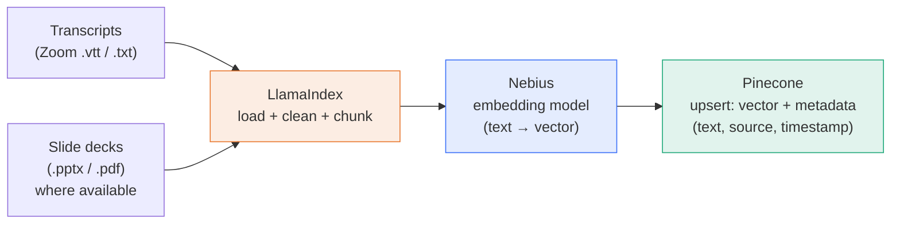
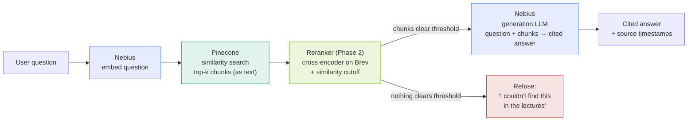

# RAG Simulator — "Glass-Box RAG" Explainer & Q&A Bot

> **Week 2 Project — Mastering Agentic AI Bootcamp**
> A working RAG application over course lecture transcripts, wrapped in an interactive UI that visualizes every step of ingestion and query in real time. The user can watch a document get chunked, embedded, stored, retrieved, reranked, and answered — and ask their own questions.

This document is the single source of truth for implementation. It is written to be consumed both by a human and by an AI coding agent (Claude Code). Build in the phase order given. Do not skip Phase 1 acceptance criteria before moving on.

---

## 1. One-liner (the Primer)

> **My RAG app helps course learners answer "how does X work / what was said about Y" questions from ~16–17 hours of bootcamp lecture transcripts (plus lecture slide decks where available), in an interactive web UI, with ≥ 90% faithfulness, ≤ 6s end-to-end latency, and an explicit "I don't know" when the answer isn't in the corpus.**

What makes this project different from a plain RAG bot: it is a **glass box**. The same pipeline a normal bot hides, this one *instruments and animates* — every stage emits a progress event that the frontend renders live. Teaching value and a real, evaluated RAG system in one deliverable.

---

## 2. Two project choices (course framework)

| Choice | Selected |
|---|---|
| Use case | **Bring your own** (Option 1) — RAG explainer over course lecture transcripts |
| Build track | **Track 2 — Code-heavy** (Python, LlamaIndex orchestration) |

Mandatory constraint satisfied: **Nebius Token Factory is used for both model calls** (embedding + generation).

---

## 3. Tech stack & tool mapping

| Layer | Tool | Role in this project |
|---|---|---|
| Orchestration | **LlamaIndex** | Loads transcripts, chunks, calls embeddings, talks to Pinecone, assembles the prompt, runs the query engine. The "glue." |
| Model calls (embedding + generation) | **Nebius Token Factory** | OpenAI-compatible API. Hosts the **embedding model** (text → vector) and the **generation LLM** (writes the cited answer). *Required by course.* |
| Vector store | **Pinecone** | Stores embeddings + chunk text/metadata; performs similarity search and returns top-k chunks. |
| GPU compute (Phase 2, optional) | **NVIDIA Brev** | Runs the cross-encoder **reranker**; optionally re-transcribes audio with Whisper for cleaner input. |
| Backend API | **FastAPI** | Exposes `/ingest`, `/query`, `/status`; streams live step events over **SSE**. |
| Frontend | **React + Vite** | Animated pipeline visualizer + chat UI. Consumes SSE. (Counts as the vibe-coded UI bonus.) |
| Deliverable doc/deck | **Gamma** | Turns the eval + write-up into the required project doc / demo deck. |

> Note on "Token Factory" the *concept* vs **Nebius Token Factory** the *product*: only Nebius is an actual tool here. They are the same thing for our purposes.

---

## 4. Architecture

### 4.1 Index time (one-time, re-runnable per new doc)



### 4.2 Query time (every question)



> In Phase 1 the reranker node is absent: retrieval feeds generation directly, and refusal is driven by the raw similarity score from Pinecone. The reranker is inserted in Phase 2 without changing the surrounding contract.

---

## 5. Layer-by-layer breakdown

**Ingestion + cleaning.** Zoom transcripts arrive as `.vtt` or `.txt` with timestamps and speaker labels. A loader normalizes them into plain text per lecture, preserving timestamp anchors. Cleaning (light in Phase 1, fuller in Phase 2) strips filler/disfluencies and applies a jargon glossary (see §8.3). Some lectures also have **slide decks** (`.pptx`/`.pdf`); a slide loader (e.g. `python-pptx` / the PDF loader) extracts text per slide *with its slide number* into the same corpus, tagged `content_type: slide` and linked to the lecture via `lecture_id`. Slides are clean, authored text — a useful counterweight to ASR errors (see §8.5). Corpus source of truth lives in `data/transcripts/` and `data/slides/`.

**Chunking + embedding.** Transcripts have no headings, so chunk on meaningful boundaries (timestamp windows / speaker turns) then size-cap. Target ~**512-token chunks with ~15% overlap**. The embedding model and its **dimension** are chosen first because Pinecone's index dimension must match exactly (see §7).

**Storage + retrieval.** Pinecone holds `{id, vector, metadata}` where metadata carries the **original chunk text** plus `source`, `lecture_id`, `timestamp_start/end`, `chunk_index`. Retrieval returns top-k matches *with text attached* — vectors are never converted back to text. Start **dense**; add **hybrid (dense + sparse/BM25)** in Phase 2 (pairs directly with the ASR-jargon problem).

**Reranking + refusal (Phase 2).** A cross-encoder re-scores Pinecone's top-k against the question and keeps the best `rerank_top_n`. A similarity cutoff filters weak chunks; if none survive, the system **refuses** rather than feeding the LLM weak context. This is the designed "I don't know" path.

**Generation.** The generation LLM receives the question + surviving chunks with a strict instruction: *answer only from the provided context; cite the source/timestamp; if the context doesn't contain the answer, say you don't know.* Output includes inline citations back to chunk metadata.

**Instrumentation (the simulator).** Every stage above emits a structured progress event (see §7.2). The backend streams these over SSE; the React UI animates the corresponding pipeline node and renders the data at that stage (sample chunk, embedding preview, retrieved chunks, final answer).

---

## 6. Repository structure

```
rag-simulator/
├── backend/
│   ├── app.py                  # FastAPI app: /ingest, /query, /status (SSE)
│   ├── rag/
│   │   ├── config.py           # env + tunables (chunk size, top_k, cutoffs)
│   │   ├── nebius.py           # LlamaIndex Nebius embed + LLM wiring
│   │   ├── pinecone_store.py   # index init + PineconeVectorStore
│   │   ├── ingest.py           # load → clean → chunk → embed → upsert (yields events)
│   │   ├── query.py            # embed → retrieve → (rerank) → generate (yields events)
│   │   ├── cleaning.py         # Phase 2: glossary + OOV scan + filler strip
│   │   └── events.py           # StepEvent schema + emit helpers
│   ├── manifest.json           # ingested-doc registry (hash → status) for dedup
│   └── requirements.txt
├── frontend/                   # React + Vite
│   ├── src/
│   │   ├── App.tsx
│   │   ├── PipelineDiagram.tsx # animated SVG, nodes light up on events
│   │   ├── IngestView.tsx      # upload + ingest stream
│   │   ├── ChatView.tsx        # ask + query stream
│   │   └── useSSE.ts           # EventSource hook
│   └── package.json
├── data/
│   ├── transcripts/            # source corpus (start with ONE file)
│   └── slides/                 # lecture decks (.pptx/.pdf), where available
├── eval/
│   ├── questions.yaml          # eval set (see §10)
│   └── run_eval.py             # scores faithfulness/relevance/latency
├── .env.example
├── PLAN.md                     # this file
└── README.md
```

---

## 7. Data contracts (build to these exactly)

### 7.1 Pinecone record

```json
{
  "id": "sha1(lecture_id + ':' + chunk_index)",
  "values": [0.021, -0.114, "... embedding, dim must match index ..."],
  "metadata": {
    "text": "the original chunk text (verbatim)",
    "source": "lecture_03.vtt",
    "lecture_id": "lecture_03",
    "title": "Week 1 - Intro to Agents",
    "timestamp_start": "00:12:30",
    "timestamp_end": "00:13:45",
    "chunk_index": 17,
    "content_type": "transcript",
    "slide_number": null,
    "deck_source": null
  }
}
```

- `content_type` is `transcript` or `slide`. For slide chunks, set `slide_number` and `deck_source` (e.g. `lecture_03.pptx`) so answers can cite "Lecture 3, slide 5". For transcript chunks these stay `null`.
- **Deterministic IDs** (hash of `lecture_id:content_type:chunk_index`) so re-ingesting **upserts** instead of duplicating. This makes ingestion idempotent and powers the "only ingest new docs" feature.
- Dedup at the doc level: store `sha1(file_contents)` in `manifest.json`; on ingest, skip files whose hash is already recorded.

### 7.2 SSE step event (backend → frontend)

Both `/ingest` and `/query` stream a sequence of these as `text/event-stream`:

```json
{
  "stage": "embed",          // load | clean | chunk | embed | upsert | retrieve | rerank | generate | done | refuse | error
  "status": "start",         // start | progress | complete | error
  "message": "Embedding 42 chunks via Nebius (bge-* , 1024-dim)…",
  "elapsed_ms": 812,
  "data": {                   // stage-specific, kept small for the UI
    "doc": "lecture_03.vtt",
    "file_size_kb": 184,
    "chunk_count": 42,
    "sample_chunk": "…one or two example chunks only…",
    "embedding_preview": [0.021, -0.114, 0.330, "…first 8 dims…"],
    "embedding_dim": 1024,
    "retrieved": [
      {"score": 0.83, "timestamp": "00:12:30", "text": "…"}
    ]
  }
}
```

The frontend keys off `stage` to animate the right pipeline node and off `data` to populate the side panel. Keep payloads small — send 1–2 sample chunks, not all of them.

---

## 8. Chunking & transcript data best practices

### 8.1 Chunk size & embedding model are chosen together
Match capacity: a ~512-token chunk pairs well with a 768/1024-dim embedding model. Don't use a 2000-token chunk on a small model (loses signal) or a tiny chunk on a huge model (waste). **Decide the embedding model + its dimension first**, then set chunk size, then create the Pinecone index with that exact dimension and `cosine` metric (or `dotproduct` if/when hybrid is enabled).

### 8.2 Transcript-aware chunking (not blind fixed-size)
- Prefer boundaries that exist in the data: **timestamp windows (~60–90s)** or **speaker turns**, then size-cap to the token target.
- Use **~15% overlap** so a thought split across a boundary isn't lost.
- **Carry timestamps into metadata** — they are your "page numbers" and become the citation surface ("Lecture 3, 12:30"). Requires timestamped transcripts (Zoom `.vtt` has them).
- Recommended LlamaIndex primitives: `SentenceSplitter(chunk_size, chunk_overlap)` for the baseline; consider `SemanticSplitterNodeParser` as a Phase 2 comparison.

### 8.3 ASR / jargon error handling (Zoom transcripts are noisy)
Tackle on three fronts; for Week 2, do the 80/20 (glossary + hybrid retrieval) and treat the rest as stretch:
1. **Prevent** — *not available to us: raw audio isn't on hand, so re-transcribing with a better ASR is out of scope.* (If audio ever becomes available, Whisper on Brev + a custom vocabulary list is the cleanest fix.) For now we lean on #2 and #3 plus the clean slide text (§8.5).
2. **Fix** — maintain a small glossary mapping (`cloud code → Claude Code`, `nebulous → Nebius`, `llm index → LlamaIndex`, `rack → RAG`, …). Run a word-boundary find-replace before chunking. Seed unknown variants via a one-time **out-of-vocabulary scan** (unique tokens diffed against an English dictionary) and optionally a tightly-constrained LLM cleanup pass (correct only listed terms, change nothing else — diff the output).
3. **Tolerate** — semantic embeddings are partly self-healing (context places "Cloud Code" near real Claude Code content), and **hybrid retrieval** recovers exact terms the glossary fixed. This is the main reason hybrid is on the roadmap.

### 8.4 Design the refusal first
A bot that hallucinates on retrieval failure is worse than one that says "not in the lectures." Implement the similarity-cutoff refusal as a first-class path and test it early (§10).

### 8.5 Slides as a second, clean source
Where slide decks exist, ingest them alongside transcripts under the same `lecture_id`. Two payoffs: (1) slides contain **correctly spelled** technical terms (product names, APIs) that Zoom's ASR mangles, so they directly counter the jargon problem and strengthen keyword/hybrid retrieval; (2) they enrich citations — an answer can point to "Lecture 3, slide 5" alongside a timestamp. Keep each slide's text as its own chunk(s) tagged `content_type: slide` with `slide_number` and `deck_source`. Optional stretch: align slides to transcript timestamp ranges if the deck timing is known; otherwise keep them as parallel chunks under the same lecture. Note both sources will surface for a query, so the generation prompt should be comfortable citing either a timestamp or a slide.

---

## 9. Configuration (`.env.example` + `config.py`)

```
# Nebius Token Factory (OpenAI-compatible)
NEBIUS_API_KEY=
NEBIUS_BASE_URL=https://api.tokenfactory.nebius.com/v1/   # (studio.nebius.com alias may still work)
NEBIUS_EMBED_MODEL=BAAI/bge-en-icl                        # 1024-dim, English. Alt: Qwen/Qwen3-Embedding-8B (4096-dim, top quality)
NEBIUS_LLM_MODEL=meta-llama/Meta-Llama-3.1-70B-Instruct   # quality. Alt: -3.1-8B-Instruct for speed/cost

# Pinecone
PINECONE_API_KEY=
PINECONE_INDEX=rag-simulator
EMBED_DIM=1024             # MUST equal embedding model dim (bge-en-icl=1024; Qwen3-Embedding-8B=4096)
PINECONE_METRIC=cosine     # switch to dotproduct when hybrid is enabled

# Tunables
CHUNK_SIZE=512
CHUNK_OVERLAP=80
TOP_K=8
RERANK_TOP_N=4             # Phase 2
SIMILARITY_CUTOFF=0.30     # below this → refuse (tune on eval set)
```

LlamaIndex wiring: use the Nebius integration packages (`llama-index-llms-nebius`, `llama-index-embeddings-nebius`) or the generic `OpenAILike` / `OpenAILikeEmbedding` pointed at `NEBIUS_BASE_URL`. Vector store via `llama-index-vector-stores-pinecone` (`PineconeVectorStore`).

---

## 10. Build phases (do in order; honor acceptance criteria)

### Phase 0 — Setup
- Create Nebius + Pinecone accounts/keys; confirm one embedding call and one chat call succeed against Nebius.
- Scaffold repo (§6), `.env`, `requirements.txt`.
- Create Pinecone index with the embedding model's exact dimension + metric.
- **Acceptance:** a 3-line script embeds "hello" via Nebius and upserts/queries it in Pinecone successfully.

### Phase 1 — Thin end-to-end slice (CLI, dense, ONE transcript)
- Implement `ingest.py` (load → light clean → chunk → embed → upsert) and `query.py` (embed → retrieve top-k → generate cited answer). Dense only. No UI.
- Refusal driven by raw Pinecone similarity vs `SIMILARITY_CUTOFF`.
- Attach full metadata (§7.1) from the first doc; use deterministic IDs.
- **Acceptance:**
  - Ingest one transcript; ask a question it *does* cover → grounded answer **with a timestamp citation**.
  - Ask something the transcript does *not* cover → **refusal**, not a hallucination.
  - Re-ingesting the same file creates **no duplicates** (idempotent).

### Phase 2 — Quality: scale corpus, hybrid retrieval, reranker, cleaning
- Add remaining transcripts **and slide decks** (slide loader → `content_type: slide` with `slide_number`/`deck_source`; §8.5).
- Implement `cleaning.py` (glossary + OOV scan; optional LLM pass).
- Enable **hybrid retrieval** (dense + sparse) — note this may require `dotproduct` metric (re-create index if so).
- Insert the **cross-encoder reranker** (e.g. `SentenceTransformerRerank`) after retrieval, before generation; run on Brev if GPU helps. Apply similarity cutoff post-rerank.
- **Acceptance:** documented **before/after** retrieval improvement on a fixed query set for (a) dense vs hybrid and (b) no-rerank vs rerank. This comparison is required eval material.

### Phase 3 — Visualizer (FastAPI + SSE + React)
- Wrap `ingest.py`/`query.py` so each stage **yields a `StepEvent`** (§7.2); stream over SSE from FastAPI.
- React: animated `PipelineDiagram` whose nodes light up per event; `IngestView` (upload + live ingest stream showing file size, chunk count, sample chunk, embedding preview, upsert); `ChatView` (ask → live retrieve/rerank/generate stream showing retrieved chunk text + scores + final cited answer).
- **Acceptance:** uploading a doc and asking a question both visibly animate the pipeline end to end with real data at each stage.

### Phase 4 — Evaluation & deliverables
- Build `eval/questions.yaml`: ~12–15 questions across **single-chunk factual**, **multi-lecture spanning**, **ambiguous**, and **unanswerable (must refuse)** categories.
- `run_eval.py`: record retrieval hit/miss, **faithfulness** (answer grounded in retrieved chunks), relevance, latency per question. Manual scoring or RAGAS.
- Failure analysis: where retrieval failed and why (chunking? ASR error? cutoff too high?).
- Produce the **Gamma** project doc/deck + record the **≤5-min video** demo; push code to **GitHub**.
- **Acceptance:** eval report with per-category scores + failure analysis; ≥ 90% faithfulness target assessed; latency ceiling (≤6s) checked.

---

## 11. Evaluation plan (detail)

| Category | # | Purpose | Expected behavior |
|---|---|---|---|
| Single-chunk factual | 4–5 | Basic retrieval+grounding | Correct, cited |
| Multi-lecture spanning | 3 | Cross-document retrieval | Synthesizes from ≥2 sources, all cited |
| Ambiguous / underspecified | 2–3 | Robustness | Reasonable answer or asks to clarify |
| Unanswerable (not in corpus) | 3 | Refusal path | **"I don't know" — no hallucination** |

Metrics: faithfulness (primary), context relevance, answer relevance, end-to-end latency. Tune `SIMILARITY_CUTOFF` so unanswerable questions refuse without over-refusing answerable ones.

---

## 12. Mapping to Week-2 deliverables

| Required deliverable | Where it comes from |
|---|---|
| Working RAG app | Phases 1–3 |
| Nebius for ≥1 model call | Embedding **and** generation both on Nebius |
| Project documentation (Google Doc) | Phase 4 write-up via Gamma — overview, datasets, vibe-coding prompts, iterations, learnings |
| Video demo (≤5 min) | Phase 4 — the simulator *is* the demo |
| Code base (GitHub link) | Whole repo (§6) |
| Bonus: vibe-coded chatbot UI | The React frontend (Phase 3) |
| Evaluation rigor (the week's core theme) | Phase 4 eval report + Phase 2 before/after comparisons |

---

## 13. Sequencing rule (important)

Build **correctness before polish**: get the Phase 1 CLI slice provably working (and the refusal path tested) *before* touching hybrid/rerank, and finish quality (Phase 2) *before* building the animated UI (Phase 3). The visualizer is the surface; the graded substance is the retrieval decisions and the evaluation beneath it. The animations must not eat the timeline — keep them to "nodes light up in sequence with real data shown," nothing fancier.

---

## 14. Open decisions to confirm during Phase 0
1. **[RESOLVED — default chosen]** Embedding model: **`BAAI/bge-en-icl` (1024-dim)** — English, lightweight, pairs with `EMBED_DIM=1024`. Upgrade option: `Qwen/Qwen3-Embedding-8B` (4096-dim) for top quality at higher storage/cost (set `EMBED_DIM=4096` + recreate index). Confirm live on the [models page](https://tokenfactory.nebius.com/models?modality=embedding).
2. **[RESOLVED — default chosen]** Generation model: **`meta-llama/Meta-Llama-3.1-70B-Instruct`** for faithful answers; drop to `-3.1-8B-Instruct` if latency/cost pushes past the 6s ceiling. Confirm/browse newer chat models on the models page.
3. **[RESOLVED — No]** Audio is **not** available, so Whisper re-transcription is out of scope. Rely on glossary cleaning + clean slide text + hybrid retrieval (§8.3, §8.5).
4. **[TODO — researching]** Hybrid + sparse encoder choice (BM25 vs SPLADE) and whether to recreate the Pinecone index with `dotproduct` metric (hybrid requires it). See the hybrid/sparse reference reading shared alongside this plan.
