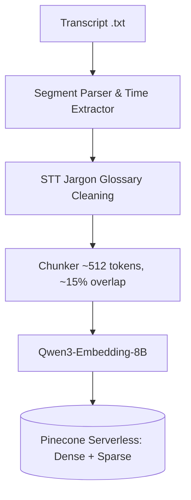
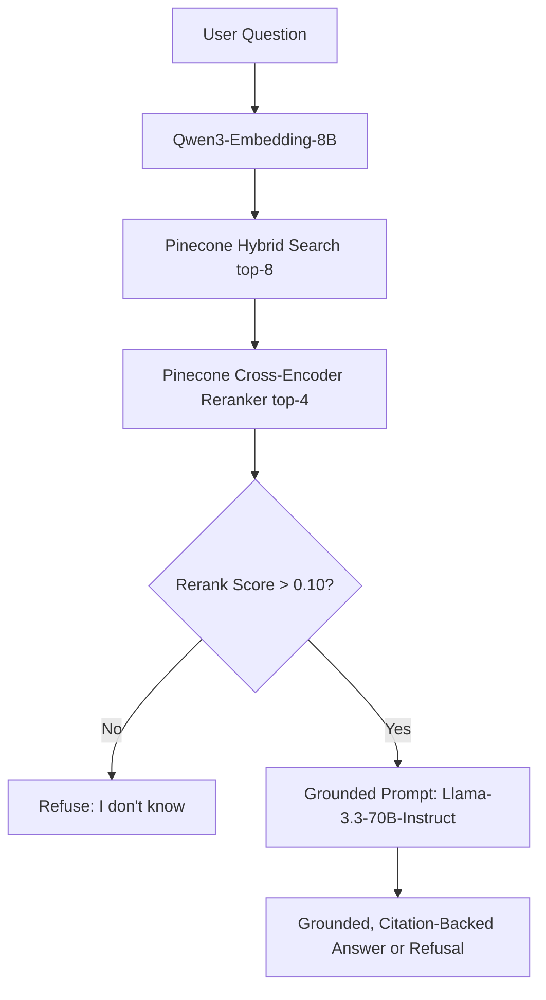

# 🧠 Course-Sessions RAG & Glass-Box Simulator

> **Week-2 Project Submission**  
> *Mastering Agentic AI Bootcamp — Gen Academy*

An advanced Retrieval-Augmented Generation (RAG) system built with **LlamaIndex**, **Nebius AI Token Factory**, and **Pinecone Serverless**. The application indexes transcripts of the cohort's weekly lectures and guest speakers, allowing learners to ask conceptual or factual questions and receive grounded, citation-backed answers (complete with session and timestamp anchors) or an honest refusal when the answer isn't in the sessions.

It includes the **Glass-Box RAG Simulator**, an interactive React dashboard that visualizes each step of the ingestion and query pipelines in real time.

---

## 🚀 Key Features & Architectural Decisions

### 1. Transcript-Aware Chunking
Lecture transcripts lack markdown headers. The parser extracts timestamps and speaker labels directly from Zoom audio transcripts, pack segments to `~512 tokens` with a `~15% overlap`, and embeds the session and timestamp metadata directly into each chunk. Every retrieved answer points back to the exact time of discussion (e.g., `[Week 1, Session 1 — 00:53:22]`).

### 2. Speech-to-Text Jargon Cleaning (Glossary)
Automatic transcripts frequently distort technical terminology (e.g., transcribing *"Claude Code"* as *"cloud code"* or *"Nemotron"* as *"nemotron"*). An ingestion glossary runs word-boundary replacements prior to chunking, dramatically improving keyword and hybrid retrieval quality.

### 3. Hybrid Search (Dense + Sparse)
Dense embeddings alone fail to capture exact terms like acronyms and product names, while sparse BM25 search misses intent. This app blends Pinecone dense retrieval with BM25 sparse vectors (using an alpha value of `0.7`), raising the `hit@3` metric by **+26 points** as the corpus scaled to 9 sessions.

### 4. Cross-Encoder Reranking
Hybrid search retrieves the top 8 chunks. A hosted cross-encoder reranker (`bge-reranker-v2-m3` on Pinecone) re-scores the question-chunk pairs together to select the top 4. Reranking pulled factual definitional chunks from rank 8 to **rank 1**, elevating retrieval MRR from `0.68` to `0.74`.

### 5. Layered Refusal Gate
To guarantee faithfulness (>90%) and eliminate hallucinations, we built a layered refusal pipeline:
* **Layer 1 (Retrieval Cutoff):** If the top rerank score falls below `0.10` (which calibrates to ≈0 for off-topic questions), the app immediately refuses.
* **Layer 2 (LLM Grounding):** A strict system prompt instructs the generation LLM to decline answering if the retrieved context does not contain the answer.
* **Result:** **100% accurate refusal** on unanswerable evaluation queries.

---

## 🛠️ Tech Stack

* **Orchestration:** [LlamaIndex](https://www.llamaindex.ai/)
* **AI Models:** [Nebius Token Factory](https://nebius.ai/)
  * **Embeddings:** `Qwen/Qwen3-Embedding-8B` (4096-dimensional)
  * **Generation:** `meta-llama/Llama-3.3-70B-Instruct`
* **Vector Store:** [Pinecone](https://www.pinecone.io/) (Serverless, Hybrid Dense + Sparse Index)
* **Reranker:** Pinecone Hosted Cross-Encoder (`bge-reranker-v2-m3`)
* **Backend:** Python 3.12 (Flask, Server-Sent Events (SSE) for pipeline updates)
* **Frontend:** React, TypeScript, Vite, Tailwind CSS (Glassmorphism layout)

---

## 📐 Pipeline Architecture

### Ingestion Flow


### Query Flow


---

## 📁 Repository Structure

* [backend/](file:///Users/akshaykshirsagar/Documents/gen-academy/Week-2/backend): Contains Python code for the ingestion and query pipelines.
  * [app.py](file:///Users/akshaykshirsagar/Documents/gen-academy/Week-2/backend/app.py): Flask application streaming real-time SSE stages.
  * [rag/](file:///Users/akshaykshirsagar/Documents/gen-academy/Week-2/backend/rag): LlamaIndex custom RAG implementation:
    * [loader.py](file:///Users/akshaykshirsagar/Documents/gen-academy/Week-2/backend/rag/loader.py) (transcript parsing), [cleaning.py](file:///Users/akshaykshirsagar/Documents/gen-academy/Week-2/backend/rag/cleaning.py) (glossary), [ingest.py](file:///Users/akshaykshirsagar/Documents/gen-academy/Week-2/backend/rag/ingest.py) (idempotent pipeline), [query.py](file:///Users/akshaykshirsagar/Documents/gen-academy/Week-2/backend/rag/query.py) (hybrid, reranking, and generation).
* [frontend/](file:///Users/akshaykshirsagar/Documents/gen-academy/Week-2/frontend): React frontend source for the Glass-Box Simulator UI.
  * `src/components/`: Modular glassmorphic elements: [PipelineRail.tsx](file:///Users/akshaykshirsagar/Documents/gen-academy/Week-2/frontend/src/components/PipelineRail.tsx) (live RAG progress visualization), [AnswerCard.tsx](file:///Users/akshaykshirsagar/Documents/gen-academy/Week-2/frontend/src/components/AnswerCard.tsx) (rendered results with inline citations), and [ConceptTour.tsx](file:///Users/akshaykshirsagar/Documents/gen-academy/Week-2/frontend/src/components/ConceptTour.tsx) (interactive educational guide).
* [eval/](file:///Users/akshaykshirsagar/Documents/gen-academy/Week-2/eval): Quality evaluation framework.
  * [questions.yaml](file:///Users/akshaykshirsagar/Documents/gen-academy/Week-2/eval/questions.yaml): 23-question test set across single-chunk, multi-session, ambiguous, and unanswerable types.
  * [run_eval.py](file:///Users/akshaykshirsagar/Documents/gen-academy/Week-2/eval/run_eval.py): CLI evaluator script.
  * [REPORT.md](file:///Users/akshaykshirsagar/Documents/gen-academy/Week-2/eval/REPORT.md): Extended metrics report.
* [PLAN.md](file:///Users/akshaykshirsagar/Documents/gen-academy/Week-2/PLAN.md): Detailed project design doc and submission checklist.

---

## ⚙️ Setup & Installation

### Prerequisite API Keys
Ensure you have access credentials for:
1. **Nebius AI:** API key to run Llama-3.3-70B and Qwen3-Embedding-8B.
2. **Pinecone:** Serverless vector index.

### 1. Backend Setup
Set up the Python environment using `uv` or standard `venv`:

```bash
# Navigate to the project root
cd Week-2

# Create environment and install dependencies
uv venv --python 3.12 .venv
source .venv/bin/activate
uv pip install -r backend/requirements.txt
```

Create a `.env` file inside `backend/.env` with your API keys:
```env
NEBIUS_API_KEY="your_nebius_api_key"
PINECONE_API_KEY="your_pinecone_api_key"
PINECONE_ENVIRONMENT="your_pinecone_environment"  # e.g., us-east-1
```

### 2. Frontend Setup
Install npm packages for the React UI:
```bash
cd frontend
npm install
```

---

## 🏃 Running the Application

### CLI Operations

All CLI commands are executed from the `backend` directory:
```bash
cd backend

# Ingest transcripts from the Input-Data directory
python -m rag.cli ingest

# Ask a test query directly from the terminal
python -m rag.cli ask "what is a context window?"

# Run the retrieval evaluation suite
python ../eval/run_eval.py --report
```

### Launching the Web Application (Glass-Box Simulator)

To run the interactive simulator, start both the Flask backend server and Vite frontend server:

1. **Start the API Server:**
   ```bash
   cd backend
   python app.py
   # Runs on http://127.0.0.1:5001
   ```

2. **Start the Frontend Dev Server:**
   ```bash
   cd frontend
   npm run dev
   # Access UI at http://localhost:5173
   ```

---

## 📊 Evaluation Summary

The retrieval strategy was optimized and tested on a golden dataset of 23 questions across multiple difficulty profiles:

| Metric | Dense Only | Hybrid (alpha=0.7) | Hybrid + Cross-Encoder Rerank |
| :--- | :---: | :---: | :---: |
| **hit@k (Any relevant chunk)** | 95% | **100%** | **100%** |
| **hit@3 (Highly ranked chunk)** | 58% | 84% | **90%** |
| **MRR (Mean Reciprocal Rank)** | 0.56 | 0.68 | **0.74** |
| **Unanswerable Refusal Rate** | 100% | 100% | **100%** (Crisper scoring boundary) |

For a comprehensive breakdown of the results and lessons learned, see the [eval/REPORT.md](file:///Users/akshaykshirsagar/Documents/gen-academy/Week-2/eval/REPORT.md) file.
